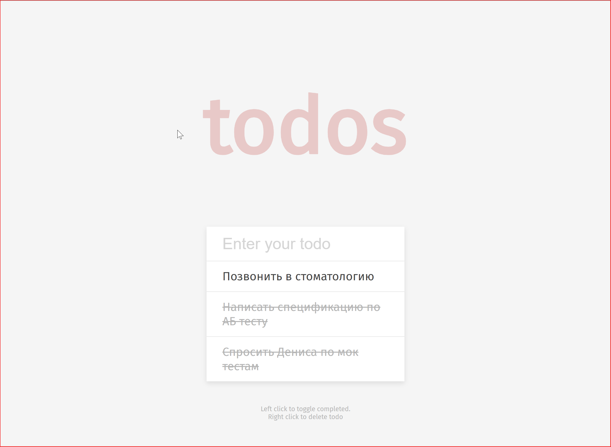

# 📝 Todo List App

Welcome to the Todo List App! This is a simple yet effective web application to help you keep track of your tasks. Add, complete, or remove tasks with ease and boost your productivity! 🚀

## 🌟 Features

- **Add Tasks:** Quickly add new tasks to your list.
- **Complete Tasks:** Mark tasks as completed with a single click.
- **Remove Tasks:** Easily remove tasks that are no longer needed.
- **Persistent Storage:** Your tasks are saved in local storage, so they persist even after you close the browser.

## 📸 Preview



## 🛠️ Technologies Used

- **HTML**: Structure of the app
- **CSS**: Styling with Fira Sans font for a modern look
- **JavaScript**: Logic for managing tasks and local storage

## 🚀 Getting Started

Follow these instructions to set up the project locally:

1. **Clone the Repository:**
   ```bash
   git clone https://github.com/good-gis/todo-list-app.git
   ```
2. **Navigate to the Project Directory:**
   ```bash
   cd todo-list-app
   ```
3. **Open `index.html` in Your Browser:**
   Simply open the `index.html` file in your preferred browser to start using the app.

## 📋 Usage

- **Add a Task:** Enter your task in the input field and press Enter.
- **Complete a Task:** Click on a task to mark it as completed.
- **Remove a Task:** Right-click on a task to remove it from the list.

## 🤝 Contributing

Contributions are welcome! Feel free to submit a pull request or open an issue if you have any suggestions or improvements.

1. Fork the repository.
2. Create a new branch:
   ```bash
   git checkout -b feature/your-feature-name
   ```
3. Commit your changes:
   ```bash
   git commit -m "Add some feature"
   ```
4. Push to the branch:
   ```bash
   git push origin feature/your-feature-name
   ```
5. Open a pull request.

## 📧 Contact

For any questions, feel free to reach out to me on [GitHub](https://github.com/good-gis).

---

Happy tasking! 🎉